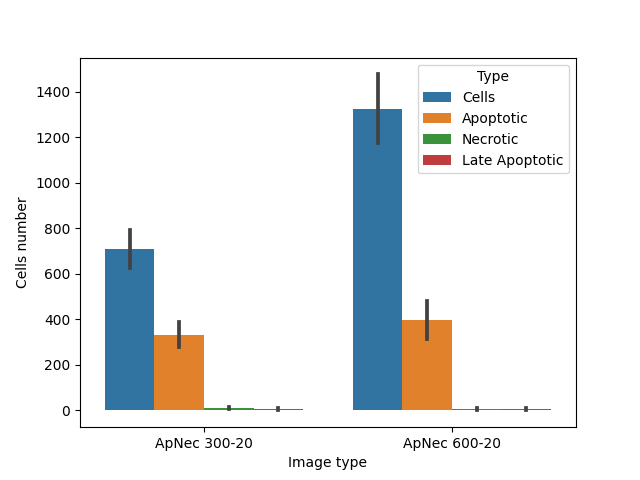

# Circle_graph.py

Circles correspond to expected equvalent diamteres (dotted line), mean (solid line) and sd. dev (semitransparent line) of objects.

# AN vero + staridst_masks.cpproj

Cell profiler pipeline

# CP_AN_table_processing.py

Script for postprocessing CellProfiler data and drawing graphs

